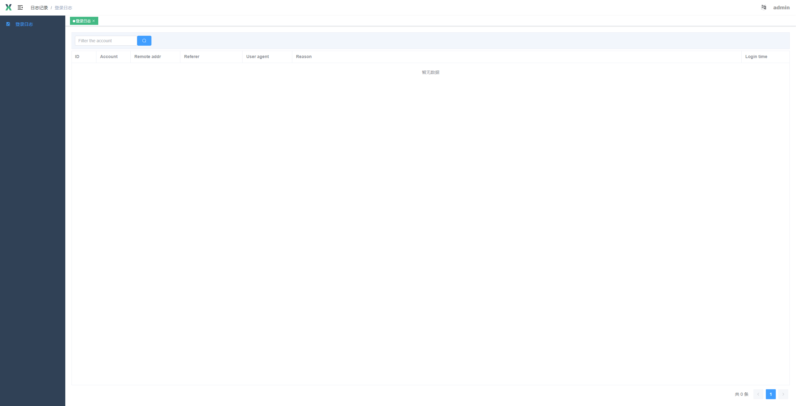

# Vue 3 + Typescript + Vite

[体验地址](https://vue3-template.github.io/vue3-template/)

简简单单的一个框架，简单易懂，欢迎大家使用，不用老是搭来搭去。

# 预览


# 启动
```
npm install
npm run dev
```

# 使用

## 路由 src/router/

常量路由constantRoutes.ts(无权限)
```
{
    path: '/login',
    name: 'login',
    component: () => import('@/views/login/index.vue'),
    meta: { hidden: true },
}
```

异步路由asyncRoutes.ts(可以有权限)
```
{
    path: '/log',
    component: Layout,
    redirect: '/log/loginLog',
    name: 'log',
    meta: {
      title: 'log',
      icon: 'log',
    },
    children: [
      {
        path: 'loginLog',
        name: 'LoginLog',
        component: () => import('@/views/log/loginLog.vue'),
        meta: {
          title: 'loginLog',
          icon: 'log',
          // src/permission.ts定义权限id
          // src/api/user.Info.permissionIds 返回需要权限id
          permissions: [permission.ShowLoginLogPage],
        },
      },
    ],
}
```

## 权限

```
// src/permission.ts 定义权限
export default Object.freeze({
  Log: 1,
  ShowLoginLogPage: 2,
})

// src/router/*.ts 路由权限
{
  ...
  children: [
    {
      ...
      permissions: [permission.ShowLoginLogPage],
    }
  ]
}

// src/components/Permission/*.ts 组件权限
<script lang="ts" setup>
import pms from '@/permission'
import { Button } from '@/components/Permission'
</script>
<template>
  <Button 
    :permissions="[pms.Log]"
    type="primary"
  >
    text
  </Button>
</template>

```


## 接口 src/api/

```
// 定义接口数据类型
export interface UserData {
  account: string
  contact: string
  id: number
  insertTime: string
  lastLoginTime: string
  name: string
  password: string
  state: number
  superManager: number
  updateTime: string
}
// 定义接口方法
export class UserList extends Request {
  readonly url = '/user/getList'
  readonly method = 'get'
  public declare datagram: {
    list: UserData[]
  }
}
```

# 进阶

[typescript](https://www.typescriptlang.org/zh/docs/)

[vite](https://cn.vitejs.dev/)

[element-plus](https://element-plus.gitee.io/zh-CN/)

# Issues

有bug或者有疑问可以提issues
